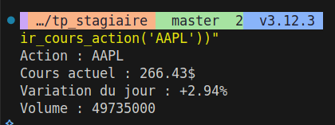
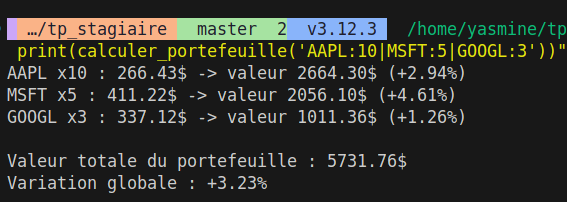
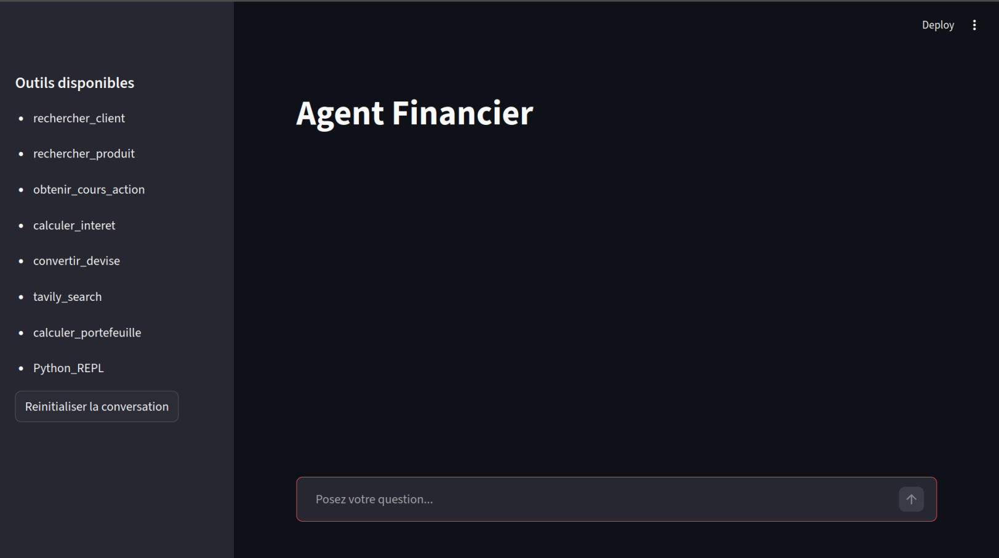
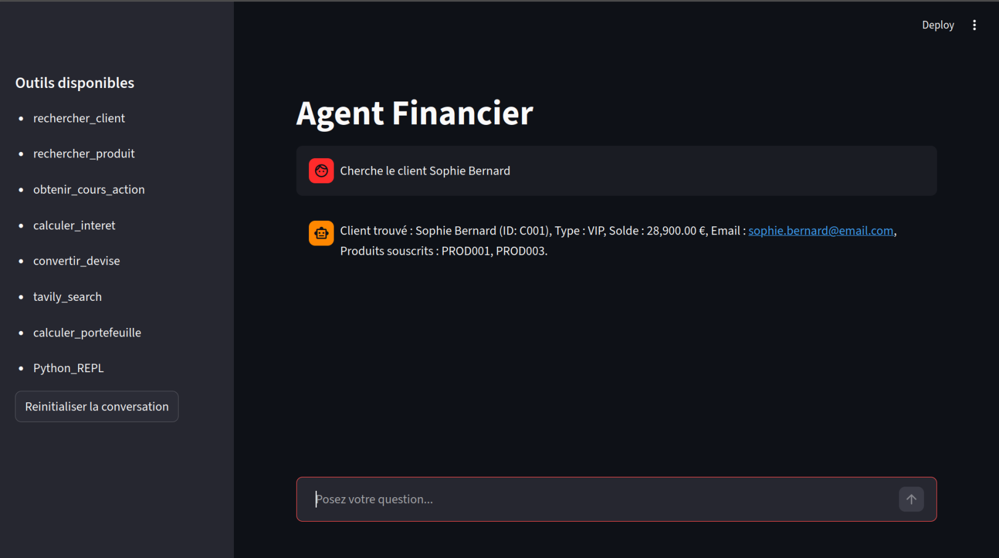
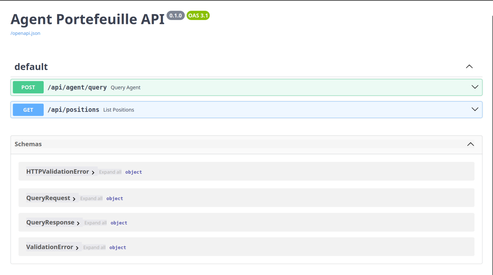
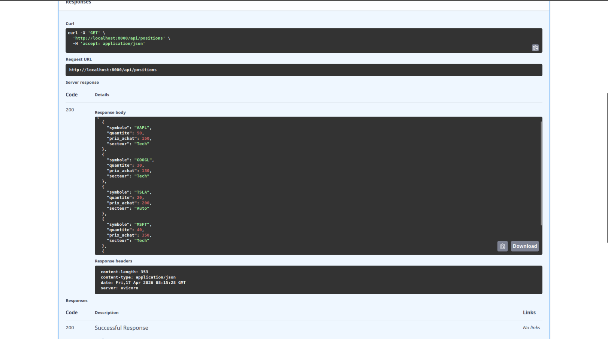

# Agent Financier

Projet de fin de TP. Un agent conversationnel qui repond a des questions financieres en utilisant des outils (base de donnees, cours boursiers, recherche web, etc).

## Parties implementees

- A1 : Base de donnees SQLite
- A2 : Cours boursiers reels avec yfinance
- A3 : Recherche web avec Tavily
- B1 : Calcul de portefeuille boursier
- B2 : PythonREPLTool
- C1 : Interface Streamlit
- C2 : Memoire conversationnelle
- D1 : API REST FastAPI

## Installation

```
git clone https://github.com/Yasminisasleep/tp_stagiaire.git
cd tp_stagiaire
python3 -m venv venv
source venv/bin/activate
pip install -r requirements.txt
```

## Configuration

Copier le fichier .env.example en .env et remplir les cles :

```
cp .env.example .env
```

Variables necessaires :
- OPENAI_API_KEY : cle API OpenAI (obligatoire)
- TAVILY_API_KEY : cle API Tavily, a creer sur tavily.com (pour la partie A3)
- DATABASE_URL : url de la base de donnees (optionnel, par defaut sqlite)

## Initialiser la base de donnees

```
python3 init_db.py
```



## Lancer l'agent en ligne de commande

```
python3 agent.py
```

Taper `demo` pour lancer la demo de memoire conversationnelle (partie C2).

## Cours boursiers en temps reel (A2)

L'agent recupere les vrais cours via yfinance :



## Calcul de portefeuille (B1)



## Interface Streamlit (C1)

```
streamlit run app.py
```



## API REST FastAPI (D1)

```
uvicorn server:app --reload
```

Documentation Swagger sur http://localhost:8000/docs





## Structure du projet

```
tp_stagiaire/
    agent.py          -> agent principal avec tous les outils
    database.py       -> fonctions de recherche client/produit (SQLite)
    finance.py        -> cours boursiers via yfinance
    init_db.py        -> script d'initialisation de la base
    app.py            -> interface Streamlit
    server.py         -> API REST FastAPI
    tools/
        portefeuille.py -> calcul de portefeuille
    .env.example
    .gitignore
    requirements.txt
```
